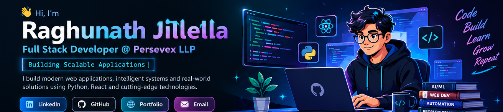
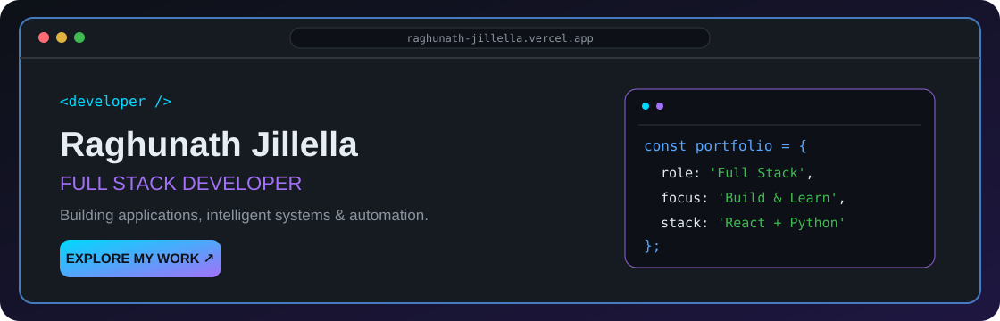
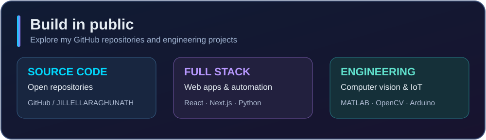

# Hi, I'm Raghunath Jillella 👋

### Full Stack Developer @ Persevex LLP · Bengaluru, India

**Building practical software, intelligent systems and meaningful digital experiences.**

## ✦ At a Glance

| 💼 Current role | 📍 Location | 🎓 Education | ⚡ Interests |
|:---|:---|:---|:---|
| Full Stack Developer · Persevex LLP | Bengaluru, India | B.Tech ECE · KARE · 2026 | Full Stack · AI/ML · IoT · Automation |

## ✦ Portfolio Spotlight

**My work, experience and engineering journey — in one place.**  
A React + Vite portfolio showcasing my development projects and technical background.

## ✦ About Me

I'm a **Full Stack Developer** with an Electronics and Communication Engineering background. I enjoy building practical applications at the intersection of **software engineering, Python, automation and intelligent systems**. My experience spans web development, databases, MATLAB image processing and IoT projects.

## ✦ Professional Experience

### 💼 Full Stack Developer · Persevex LLP
**Bengaluru, India**

Working on web application development, frontend interfaces, backend functionality, database integration and maintenance. My Project [WorkSync](https://github.com/JILLELLARAGHUNATH/Persevex-Worksync) uses **Next.js, React, TypeScript, Prisma, Supabase and Tailwind CSS**. Specific responsibilities, launch status and internal features should be published only after company approval.

### 🔬 MATLAB Image Processing Intern · Youngminds Technology Solutions Pvt. Ltd.
**May 2024 – July 2024**

Worked on MATLAB-based agricultural weed detection using image preprocessing, segmentation, morphological operations and region visualization. [Explore the public project](https://github.com/JILLELLARAGHUNATH/weed-detection).

## ✦ Tech Stack

<table>
<tr><td><b>Languages</b></td><td></td></tr>
<tr><td><b>Frontend</b></td><td></td></tr>
<tr><td><b>Backend & Data</b></td><td></td></tr>
<tr><td><b>Computer Vision & IoT</b></td><td></td></tr>
<tr><td><b>Developer Tools</b></td><td></td></tr>
</table>

**Also working with / exploring:** SQL · Power BI · YOLO · AI/ML · automation. Technologies above reflect a mix of professional use, projects and learning—not equal proficiency in every tool.

## ✦ Featured Projects

<table>
<tr>
<td width="50%" valign="top">
<h3>⚡ Persevex WorkSync</h3>

Workforce and attendance-oriented web application. Public codebase built with Next.js, React, TypeScript and Prisma.

 

<a href="https://github.com/JILLELLARAGHUNATH/Persevex-Worksync">↗ View repository</a>
</td>
<td width="50%" valign="top">
<h3>🏥 Hospital Scheduler</h3>

Frontend scheduling challenge with doctor filters, day/week calendar views and appointment categories.

 

<a href="https://github.com/JILLELLARAGHUNATH/Hospital-Scheduler">↗ View repository</a>
</td>
</tr>
<tr>
<td width="50%" valign="top">
<h3>🎓 Student Management System</h3>

Python and SQLite web application with student record CRUD operations and a simple browser interface.

 

<a href="https://github.com/JILLELLARAGHUNATH/Student-Management-System-">↗ View repository</a>
</td>
<td width="50%" valign="top">
<h3>🌿 Weed Detection</h3>

MATLAB computer vision workflow using segmentation, denoising, morphology and bounding-box visualization.

 

<a href="https://github.com/JILLELLARAGHUNATH/weed-detection">↗ View repository</a>
</td>
</tr>
<tr>
<td width="50%" valign="top">
<h3>🌐 Developer Portfolio</h3>

Personal developer portfolio built with React, Vite and Framer Motion.

 

<a href="https://raghunath-jillella.vercel.app/">↗ Live portfolio</a> · <a href="https://github.com/JILLELLARAGHUNATH/Portfolio">Source code</a>
</td>
<td width="50%" valign="top">
<h3>🧮 Tkinter Calculator</h3>

Desktop calculator with a Python Tkinter interface and arithmetic operations.

 

<a href="https://github.com/JILLELLARAGHUNATH/Calculator-using-Tkinter">↗ View repository</a>
</td>
</tr>
</table>

**Other work:** Voice-Controlled Autonomous Car · Automated Malpractice Detection System · Offer Letter Generator. Additional public links and internal implementation details can be added after verification and approval. Computer vision alerts are indicators for review, not proof of misconduct.

## ✦ GitHub Activity

<!-- Optional live streak: remove this image if the external service is unavailable. -->

The overview card is stored in this repository and always displays. The optional live streak is provided by a third-party service and may occasionally be unavailable.

## ✦ Education & Current Focus

**B.Tech in Electronics and Communication Engineering** · Kalasalingam Academy of Research and Education · **2026**

**Currently exploring:** Full stack architecture · AI/ML · Computer vision · IoT · Git/GitHub workflows.

### ✨ Code · Build · Learn · Grow · Repeat

*Turning ideas into useful software through curiosity, engineering and continuous learning.*

