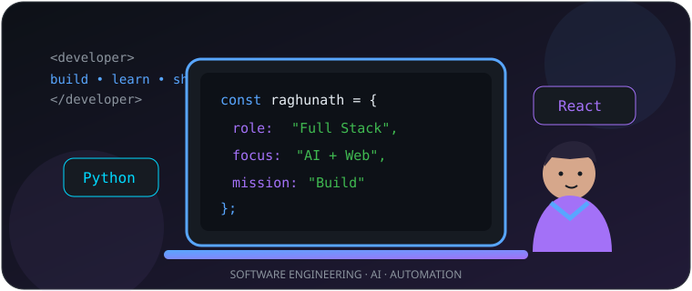

  

# Hi, I'm Raghunath Jillella
### Full Stack Developer @ Persevex LLP · Bengaluru, India

**Building practical applications, intelligent systems and meaningful digital experiences.**

<!-- Portfolio URL pending verification: https://raghunathjillella.onrender.com/ -->

## About me

I'm a **Full Stack Developer at Persevex LLP**, with a B.Tech in **Electronics and Communication Engineering** from **Kalasalingam Academy of Research and Education (2026)**. My background connects electronics, embedded systems and MATLAB image processing with web development, databases and automation. I enjoy building useful software and exploring AI, computer vision and IoT.

| Currently | Details |
|:--|:--|
| **Role** | Full Stack Developer · Persevex LLP |
| **Location** | Bengaluru, Karnataka, India |
| **Interests** | Full Stack · Python · AI/ML · Computer Vision · IoT |

## Professional experience

### Full Stack Developer — Persevex LLP
*Bengaluru, India · Joining date: awaiting confirmation*

Developing web application interfaces and backend workflows, integrating data and maintaining application functionality. My public **[Persevex WorkSync repository](https://github.com/JILLELLARAGHUNATH/Persevex-Worksync)** contains a Next.js / React / TypeScript application with Prisma, Supabase and Tailwind CSS dependencies. WorkSync is a workforce and attendance management project; the precise completed features and my individual contributions are pending confirmation.

> Company-specific details and internal screenshots will only be added with permission.

### MATLAB Image Processing Intern — Youngminds Technology Solutions Pvt. Ltd.
*May 2024 – July 2024*

Worked on agricultural weed detection with MATLAB image processing, including image preprocessing, segmentation, morphological operations and region visualization. [Explore the public project](https://github.com/JILLELLARAGHUNATH/weed-detection).

## Technical toolkit

**Programming & web**

**Databases & tools**

**Engineering & computer vision**

**Also using or exploring:** SQL · Power BI · YOLO · IoT sensors · AI/ML. Experience varies across professional work, projects and ongoing learning.

## Selected projects

### 01 · Persevex WorkSync
**Workforce management and attendance-oriented application**

A Next.js application with React, TypeScript, Prisma, Supabase and Tailwind CSS. The public repository documents its technical stack; company-approved descriptions of production features and individual contributions are pending.

### 02 · Hospital Appointment Scheduler
**Scheduling interface for a frontend developer challenge**

Next.js 14 · TypeScript · Tailwind CSS · React Hooks · date-fns. Includes doctor filtering, day and week calendar views, and appointment-type categorization.

### 03 · Student Management System
**Student record management and CRUD**

Python · SQLite · HTML · CSS. A lightweight web application to add, view, update and delete student records. This is the **web version** in the linked repository; my earlier Tkinter version is a separate project.

### 04 · Weed Detection
**MATLAB computer vision for precision agriculture**

Image preprocessing, RGB channel analysis, denoising, threshold segmentation, morphological processing and bounding-box visualization. The repository also documents sensitivity, specificity and predictive-value evaluation.

### 05 · Personal Developer Portfolio
**React and Vite portfolio**

React · Vite · JavaScript · Framer Motion. Public source code is available; the latest live deployment URL is pending verification.

### More work

- **[Calculator using Tkinter](https://github.com/JILLELLARAGHUNATH/Calculator-using-Tkinter)** — Python desktop GUI for arithmetic operations.
- **Voice-Controlled Autonomous Car** — Arduino, voice commands and IoT sensors; public repository link pending.
- **Automated Malpractice Detection System** — computer vision project; public repository and completed feature list pending. Model flags are indicators for review, not proof of misconduct.
- **Automated Offer Letter Generator** — Flask and PDF automation; public-showcase permission and current deployment pending.

## Education & community

**B.Tech, Electronics and Communication Engineering** · Kalasalingam Academy of Research and Education · **2026**

IEEE and IETE student involvement. Specific positions, award titles and certifications will be added after verification.

## GitHub activity

  
  

> Statistics are supplied by third parties and may be temporarily unavailable. Repository language proportions do not measure proficiency.

## Current focus

**Building:** Full stack applications · **Strengthening:** backend systems and databases · **Exploring:** AI/ML, computer vision and automation.

### Let's build something useful.

[Email](mailto:jillellaraghunath@gmail.com) · [LinkedIn](https://www.linkedin.com/in/jillella-raghunath-ece-a69555268) · [GitHub](https://github.com/JILLELLARAGHUNATH)

